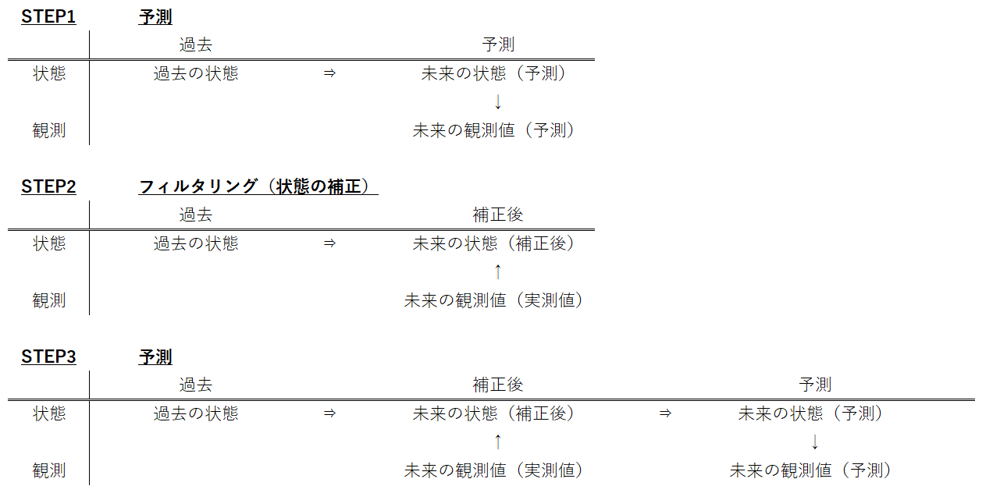

```{r setup, include=FALSE}
knitr::opts_chunk$set(echo = TRUE)
```


# 状態方程式・観測方程式

線形ガウス状態空間モデルは下記のように定式化される。  
上が状態方程式、下が観測方程式。  


$$
\begin{aligned}
x_{t}&=T_{t}x_{t-1}+R_{t}\xi _{t}, &~~~~~~\xi _{t}\sim N\left( 0,Q_{t}\right)\\
y_{t}&=Z_{t}x_{t}+\varepsilon_{t}, &~~~~~~\varepsilon _{t}\sim N\left( 0,H_{t}\right) 
\end{aligned}\tag{1}
$$

$x_{t}$は$t$時点の状態を表す。状態は、$k$次元のベクトルを取る。つまり、状態を様々な要素の和として表現することができる。  
$y_{t}$は$t$時点の観測値。$T_{t}, R_{t}, Z_{t}$はモデルの表現形式を決める行列となる。  

日本語だと以下の表現になる。  


$$
\begin{aligned}
状態 &= 前時点の状態を用いた予測値 + 過程誤差\\
観測 &= 状態 + 観測誤差
\end{aligned}\tag{2}
$$

#  データの表現とパラメタ推定

データの表現とパラメタ推定は分けて理解すべき。  

## データの表現
データの表現は、状態方程式と観測方程式で表される。 


## パラメータ推定

～フィルタ系と、MCMCを用いるグループの大きく2つに分かれる。  
フィルタリングの代表としては、カルマンフィルタが有名。   
MCMCの代表として、HMC法など。  
最も有名な方法は、カルマンフィルタ+最尤法。  


## 状態推定：予測とフィルタリング

フィルタリングは、手に入った**観測値を用いて予測された状態の値を補正**することを指す。  
状態方程式における状態の更新式を用いて予測を行う。


   
最新の観測地を用いて即座に誤りを補正し、次の予測を行うことができる。  
カルマンフィルタを用いると、これらの計算を効率よく行うことができる。  


## 状態推定：平滑化

平滑化はすべてのデータが整った後に、状態の補正を行う計算を指す。  
未来の観測地を使って、過去の状態を補正しても予測の精度は上がらないが、補正に使われる情報が増えるため、ノイズの影響を軽減できる。  


## パラメタ推定：最尤法

観測データを用いて状態を補正するためにはいくつかの情報が必要。  
代表的な情報として、過程誤差の分散と、観測誤差の分散。  

 - 過程誤差が大きい
   - Step1の予測の当たりが悪い事を意味する。予測された未来の状態の精度が悪いので、「観測値を用いた状態の補正」が必要な状態。
   
 - 観測誤差が大きい
   - 観測地をあまり信用できないことを意味する。信用度が低いということは「観測値を用いた状態の補正」はあまり行わない方がいい状態。
   
つまり、**何方の誤差の大きさの比率を勘案しつつ、フィルタリング（状態の補正）を行う**という事。  

このために最尤法を用いたパラメタ推定が行われる。


 1. まずは、根拠なしにとりあえずパラメタを設定し、カルマンフィルタを実行する。
 2. すると、テキトーに状態の補正が行われてしまう事になる。これを逐次評価して、パラメタの微修正を繰り返すことで最適なパラメタを探す。  
 この時の評価指標を「尤度」と呼び、尤度を最大にするパラメタ推定の方法を最尤法という。
 3. たとえば、過程誤差も観測誤差もともに小さな値を設定していたとする。  
 観測データが手に入れば（観測誤差が小さいので）状態は補正されるはず。  
 さらに、過程誤差が小さいので未来の状態も精度よく予測されているはず。  
 正しく補正された上に、精度よく予測された予測結果が、実データと全く異なる値、つまり予測誤差が大きければそれはパラメタ設定が間違っていることとなる。
 
 
# 線形ガウス状態空間モデルを推定する流れ

 0. データの変換（対数変換など）。差分は取る必要がない（定常過程を前提としていないため）。
 1. 状態方程式、観測方程式を用いてモデルの構造を表現する。
 2. 仮で決めたパラメタを使ってフィルタリングする。
 3. カルマンフィルタの結果を援用し、最尤法を用いてパラメタ推定する。
 4. 推定されたパラメタを用いて、再度フィルタリングを行う。
 5. （必要により）推定されたパラメタを用いて平滑化を行う。
 
 
 
# 線形回帰モデルと状態方程式・観測方程式

簡単な、説明変数のない切片だけの線形回帰モデルを


$$
\begin{aligned}
y_{t}&=\alpha + v_{t}, &~~~~~~v _{t}\sim N\left( 0,\sigma_{v}^2\right)\\
\end{aligned}\tag{3}
$$


仮に、状態方程式・観測方程式で表すと以下になる。


$$
\begin{aligned}
x_{t}&=\alpha\\
y_{t}&=x_{t} + v_{t}, &~~~~~~v _{t}\sim N\left( 0,\sigma_{v}^2\right)\\
\end{aligned}\tag{4}
$$


誤差項を入れ替えて下にしても同じ


$$
\begin{aligned}
x_{t}&=\alpha + w_{t}, &~~~~~~w _{t}\sim N\left( 0,\sigma_{w}^2\right)\\
y_{t}&=x_{t} \\
\end{aligned}\tag{5}
$$


(4)式で解釈すると、状態の値が時点によらず一定で、一定の分散の観測誤差だけがあると仮定した状態空間モデルとみなせる。  


# 自己回帰モデルと状態方程式・観測方程式


# 簡単な実装例（カルマンフィルタのコード）

ナイル川の流量データを分析対象とする。  
1年に一回観測され、1871年~1970年まで100年間取得されたデータ。
Rを用いてカルマンフィルタを実装する。  
まず、予測とフィルタリングを行う関数を作成する。


```{r}

kfLocalLevel <- function(y, mu_pre, P_pre, sigma_w, sigma_v){
  # Step1 予測
  
  # 状態の予測値 <- 前期の状態
  mu_forecast <- mu_pre
  
  # 状態の予測誤差の分散(mu_forecastの分散)　<- 前期の状態の予測誤差の分散(mu_preの分散) + 過程誤差の分散
  P_forecast <- P_pre + sigma_w
  
  # 観測値の予測値 <- 状態の予測値
  y_forecast <- mu_forecast
  
  # 観測値の予測誤差の分散(y_residの分散) <- 状態の予測誤差の分散(mu_forecastの分散) + 観測誤差の分散
  F_ <- P_forecast + sigma_v
  
  
  # Step2 フィルタリング（状態の補正）
  
  # カルマンゲイン <- 状態の予測誤差の分散(mu_forecastの分散) / (状態の予測誤差の分散(mu_forecastの分散) + 観測誤差の分散)
  K <- P_forecast / (P_forecast + sigma_v)
  
  # 観測値の予測残差 <- 観測値 - 観測値の予測値
  y_resid <- y - y_forecast
  
  # 補正後の状態（フィルタ化推定量） <- 状態の予測値 + カルマンゲイン * 観測値の予測残差
  mu_filter <- mu_forecast + K * y_resid
  
  # フィルタ化推定量の分散（mu_filterの分散） <- (1-カルマンゲイン) * 状態の予測誤差の分散（mu_forecast）
  P_filter <- (1 - K) * P_forecast 
  
  
  # 結果の格納
  
  result <- data.frame(mu_filter = mu_filter,
                       P_filter = P_filter,
                       y_resid = y_resid,
                       F_ = F_,
                       K = K
                       )
  
  return(result)
  
}


```


上記で作ったカルマンフィルタ関数を、時点をずらしながら何度も実行することで、フィルタ化推定量を求めることができる。  
まずは、フィルタ化推定量を格納する入れ物を用意。  
初期の状態は0に、状態の予測誤差の分散の初期値は10^7と置いた。

```{r}
# サンプルサイズ
N <- length(Nile)

# 状態の推定値
mu_filter <- numeric(N)

# 状態の初期値は0とする
mu_zero <- 0
mu_filter <- c(mu_zero, mu_filter)

# 状態の予測誤差の分散
P_filter <- numeric(N)


# 状態の予測誤差の分散初期値
P_zero <- 10000000

P_filter <- c(P_zero, P_filter)


# 観測値の予測残差
y_resid <- numeric(N)

# 観測値の予測誤差の分散
F_ <- numeric(N)

# カルマンゲイン
K <- numeric(N)
```


時点0の初期値があるので、配列の長さが異なっている。

mu_filter , P_filter -> n + 1  
yなど -> n  


最後に過程誤差・観測誤差の分散を指定する。  
このパラメタは後に最尤法を用いて最適な値に変更する。

```{r}
# 過程誤差の分散
sigma_w <- 1000

# 観測誤差の分散
sigma_v <- 10000


```

以降、for loopを回して、kfLocalLevel関数を時点をずらしながら連続実行する。

```{r}
for (i in 1:N){
  
  kekka <- kfLocalLevel(y = Nile[i], 
                        mu_pre = mu_filter[i],
                        P_pre = P_filter[i],
                        sigma_w = sigma_w,
                        sigma_v = sigma_v )
  
  mu_filter[i + 1] <- kekka$mu_filter
  P_filter[i + 1] <- kekka$P_filter
  y_resid[i] <- kekka$y_resid
  F_[i] <- kekka$F_
  K[i] <- kekka$K
  
}

```

